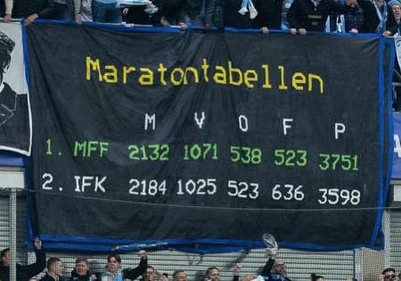

#### Projektet är under ombyggnad, ursäkta röran så länge

*Tifo från matchen mellan IFK Göteborg och Malmö FF våren 2023*

# Allsvensk statistik
Jag samlar på mig och har lite kul med statistik från herrallsvenskan i fotboll. En del fokus på Malmö FF.

Själva statistiken och graferna hittar du i [notebooks/](notebooks)-mappen.

## Datan
Det började med att jag ville hitta ett diagram över maratontabellens utveckling över tid. När det inte gick bestämde jag mig för att göra ett eget.

Datan är plockad från [everysport.com](https://everysport.com) och sparad i en [SQLite-databas](data/allsvenskan.db) via SQLAlchemy.

För tillfället finns sluttabeller från alla allsvenska säsonger, och tabeller från de flesta omgångar som spelats. De finns också tillgängliga i en [csv-fil](data/allsvenskan.csv), som är den jag använder för att göra graferna.